  
  <!-- dynamic typing effect 动态打字效果 -->
  

    
  

  
  

  <!-- knock code pictures 敲代码的图片 -->
   

  <!-- profile logo 个人资料徽标 -->
  

    &emsp;
    &emsp;
    &emsp;
    &emsp;
    &emsp;
    &emsp;
    <!-- visitor statistics logo 访问量统计徽标 -->
    
  

<!-- Snake Code Contribution Map 贪吃蛇代码贡献图 -->
<picture>
  <source media="(prefers-color-scheme: dark)" srcset="https://cdn.jsdelivr.net/gh/sun0225SUN/sun0225SUN/profile-snake-contrib/github-contribution-grid-snake-dark.svg" />
  <source media="(prefers-color-scheme: light)" srcset="https://cdn.jsdelivr.net/gh/sun0225SUN/sun0225SUN/profile-snake-contrib/github-contribution-grid-snake.svg" />
  
</picture>

#  🙋 Hello

<table>
<tr>
<td>
<!-- About me 关于我 -->
### :woman_technologist: About Me :

 I am a Full Stack Developer  from China.

- :telescope: 我是一名软件工程师，为构建web应用程序的前端和后端做出贡献。.

- :seedling: 热爱计算机科学和IT互联网事业，励志成为一名优秀的开发者。.

- :zap: We're making the world a better place. Through constructing elegant hierarchies for maximum code reuse and extensibility.
 
</td>
</tr>

<tr>
<td>
  
<!-- ########################################## 分割 ########################################## -->

<!-- just img 图片 -->

<!--  skill badge 技能徽章 -->

```mermaid
mindmap
  root((小林同学))
    编程
      前端开发
      后端开发
    娱乐
      音乐
      游戏
      旅行
    阅读
      个人成长
      军事科技
      计算机技术
```

💪 正在学习

  
🧠 计划学习

🧰 常用的工具

<!-- programming tool icon 编程工具图标 -->
 

<!-- svg -->

 

 

<!-- gif -->

<!-- just img 图片

-->

  
<!-- Quotes 名人名言 -->
 
  
<!-- GitHub 奖杯🏆 -->
 

  
<!-- Wakatime Graph-->
<table>
  <tr>
    <td></td>
    <td></td>
  </tr>
  <tr>
   </td>
  </tr>
</table>

<!-- run 图片 -->

<!-- Joke 笑话 -->

  

<!-- github-readme-streak-stats 连续提交代码天数记录 -->
&emsp;

&emsp;

&emsp;

&emsp;

&emsp;

&emsp;
<!-- GitHub Activity Graph GitHub 活动图 -->

<!-- ########################################## 分割 ########################################## -->

